# استيراد الإحصاءات، الأنشطة الرئيسية والفرعية، وهوية المسارات

الفرع: `feature/visual-redesign-and-sector-classification` (PR #1). هذه الوثيقة تسجّل ما نُفّذ فعليًا ونتائجه.

## 1. مصادر البيانات وحصرها

المصدر الوحيد للأرقام: ملفات Excel في `data/raw` (لا أرشيفات فيها؛ ملفات القفل `~$` تُتجاهل). موقع المؤسسة استُخدم للهوية البصرية فقط.
`data/Projects List_2026_09-29.xlsx` مرجع تصنيف المشروع ← المسار فقط، ولا يُقرأ منه أي رقم.

| المجموعة | الملفات | الشكل |
|---|---|---|
| 2025 | 10 ملفات أرقام + `temp.xlsx` | أوراق شهرية (أيلول–كانون الأول) بخلايا مدمجة وصف «الإجمالي»، وورقة Total مسطحة |
| 2026 | 24 ملفًا | 12 ملفًا بأوراق شهرية (Jan–Dec) + Total، و12 ملفًا بورقة واحدة فيها عمود «الشهر» |

اختلاف الأعمدة بين الملفات حقيقي: بعضها Level 1 فقط، وبعضها Level 2 و3 دون Level 1، وبعضها الثلاثة؛ أعمدة الأعمار
(«ذكور -18»…)، «عدد الشعب»، «رقم الدورة»، «ذوو الاحتياجات الخاصة»، و«الاختصاص/الجامعة» (رواد المعرفة)، و«عدد الأضاحي/العوائل» (أضحيتي).
خريطة الأعمدة تُبنى من عناوين كل ورقة على حدة، لا بافتراض موضع ثابت.

## 2. قرارات القراءة (موثقة في الكود: `StatisticsSheetParser`, `RowValueResolver`, `StatisticsImporter`)

- **مصدر السجلات = الأوراق الشهرية/الورقة الوحيدة.** ورقة Total نسخة مسطحة: طابقت الأوراق الشهرية في كل ملفات 2026،
  لكنها تكتب الأشهر غير المعبأة أصفارًا، وفي «أثر 2025» نسخت صف «الإجمالي» كأنه سجل. لذا تُستخدم للمطابقة فقط، ولاسترجاع تسمية
  (مكتب/Level) فارغة خارج الدمج عندما تتطابق كل أرقام الصف المقابل (21 حالة). لا تُجمع النسختان أبدًا.
- **الخلايا المدمجة** تُقرأ من الخلية العليا لنطاق الدمج نفسه فقط؛ لا ملء للأسفل خارج النطاق، ولا ملء للخلايا العددية.
- **فارغ ≠ صفر:** صف لم يُدخل فيه أي رقم يدويًا (فراغ أو «-» أو صيغ فوق فراغ) = غياب بيانات، لا يُستورد (8,563 صفًا).
  الصفر المكتوب صفر صريح ويُستورد (2,988 سجلًا قيمتها 0).
- **الذكور/الإناث** = مجموع فئتي العمر عند إدخالهما، وإلا الرقم المكتوب. **الإجمالي** = ذكور + إناث؛ ذوو الاحتياجات الخاصة جزء منه
  لا يُضافون فوقه. نتيجة صيغة مخزنة تخالف مكوناتها (صيغ قديمة أو تضيف ذوي الاحتياجات) تُعاد حسابها من المكونات وتُسجَّل (47 حالة)، دون تعديل الملف.
- **جنس واحد مدخل** والآخر فارغ: يُحفظ الإجمالي كما تحسبه الورقة، والجنس الآخر «غير مذكور» لا صفر (96 حالة).
- **نسب تقديرية للجنس** (`F*60%` في «رمضان الخير»): لا تُحفظ كأعداد؛ يُحفظ الإجمالي فقط (104 خانة في 52 صفًا).
- **تعارض لا يُحسم:** رقم ذكور/إناث مكتوب يخالف فئات العمر ويغيّر الإجمالي ← يُعزل الصف (8). إذا بقي الإجمالي متطابقًا يُحفظ دون توزيع الجنس (1).
  ذوو احتياجات أكثر من الإجمالي ← يُحجب هذا الحقل (7). صف بلا عدد أشخاص (قيم أخرى فقط) ← يُعزل (3).
- **الوحدات:** «أضحيتي» يعدّ العوائل (والأضاحي) ← قياس منفصل `households_served` لا يُجمع مع الأشخاص أبدًا.
  «رقم الدورة» معرّف نصي لا يُجمع؛ «عدد الشعب» يُحفظ ولا يُضاف إلى الأشخاص.
- **الفترة:** الشهر من اسم الورقة أو عمود «الشهر»، والسنة من مجلد الملف.
  - ورقة «كانون الثاني» في `2025/أثر.xlsx` تأتي بعد كانون الأول وتقول ورقة Total إنها 2025 ← غير محسومة، لم تُستورد؛ محتواها مطابق لكانون الثاني 2026 المستورد من `أثر 2026` (1,353).
  - `جامعة الرواد.xlsx` بلا شهر ولا تاريخ (عمود «السنة» هو السنة الدراسية) ← لم يُستورد (37 صفًا بقيم، مجموعها 925).
  - أشهر بعد تاريخ الاستيراد (تشرين الثاني/كانون الأول 2026) لا تحمل أرقامًا حقيقية ← استُبعد صفّا صفر فيهما.
- **ربط الملف بالمشروع** صريح في `config/statistics_import.php` باسم المشروع في قائمة المشاريع، مع ملاحظة لكل اختلاف
  (مثل «الابتكاري»/«الابتكار»، «تفتيت الحصيات» ← «جهاز تفتيت الحصيات ضمن مشفى ابن رشد» لا «ترميم غرفة جهاز الحصيات»).
  ملف غير مدرج لا يُستورد. التكرار يُكشف بالبصمة SHA-256 وبمفتاح السجل (مصدر آخر لنفس المفتاح في التشغيل نفسه يُرفض).
- **تصنيف 2025:** لا يوجد مرجع تصنيف لـ 2025، فسجلاتها «غير مصنف» (39,883) وتبقى في الإجمالي العام دون نسبتها لمسار.

## 3. النموذج

تفاصيل الجداول في [data-model.md](data-model.md). باختصار: `activity_records` بأدق مستوى (مشروع، شهر، مكتب، قياس، Level 1، نشاط رئيسي،
نشاط فرعي، رقم الدورة، الخصائص، ترتيب التكرار) مع الملف وبصمته والورقة والصف وتشغيل الاستيراد؛ `activity_record_revisions` لكل تغيير؛
`import_runs` و`import_issues` للتقارير. الإجماليات (فرعي ← رئيسي ← مشروع ← مسار ← مؤسسة) جمعٌ للسجلات نفسها، ولا يُخزَّن أي إجمالي أب.

## 4. نتيجة الاستيراد المحلي (التشغيل الأخير #8، ونسخة احتياطية JSON للقاعدة قبل الترحيل خارج Git)

| المؤشر | القيمة |
|---|---|
| ملفات مستوردة | 33 (من 35 ملف أرقام) · مستثنى: `temp.xlsx` (قالب بلا قيم، تحقق: لا صف بقيم) · معزول: `جامعة الرواد.xlsx` (بلا فترة) |
| السجلات الفعالة | 6,222 (2025: 2,685 · 2026: 3,537) |
| الفترات | 13 شهرًا: أيلول–كانون الأول 2025، كانون الثاني–أيلول 2026 |
| المشاريع ذات البيانات | 22 من 56 (21 باستفادات مسجلة + «أضحيتي» بالأسر) |
| الأنشطة | 102 نشاطًا رئيسيًا · 62 نشاطًا فرعيًا · 101 تصنيف Level 1 |
| الاستفادات المسجلة | **162,843** (ذكور 66,169 · إناث 87,634 · غير مذكور الجنس 9,040 · منهم ذوو احتياجات مسجلون 3,570) |
| حسب السنة | 2025: 39,883 (غير مصنف) · 2026: 122,960 |
| الأسر المستفيدة | 1,787 أسرة · 89 أضحية (منفصلة عن الأشخاص) |
| «لعبة وفرحة» | 1,450 (718/732) — سجلات العينة السبعة استُبدلت بالمصدر الحقيقي دون تكرار |

**مقارنة قبل/بعد:** قبل الاستيراد 7 سجلات (عينة «لعبة وفرحة»، 1,450). بعده 6,222 سجلًا فعالًا، والمجموع 162,843 + 1,787 أسرة.
تفصيل كل ملف (صفوف مقروءة/فارغة/معزولة، جديد/محدَّث/دون تغيير، الفترات) وجدول قبل/بعد لكل مشروع في
`backend/storage/app/reports/statistics-import.md` (خارج Git؛ يُعاد إنشاؤه بالأمر).

**المشاريع المصنفة بلا بيانات (34):** لا يوجد لها ملف أرقام في `data/raw`، أو ملفها بلا فترة (جامعة الرواد). تظهر في الواجهة بـ«لا توجد بيانات».

### التعارضات والاستثناءات (من `import_issues`)

| النوع | العدد | المعالجة |
|---|---|---|
| `conflicting_counts` | 8 | صف معزول: الذكور/الإناث المكتوب يخالف الأعمار ويغيّر الإجمالي |
| `no_count` | 3 | صف معزول: لا عدد أشخاص |
| `future_period` | 2 | صفّا صفر لشهرين لم يحينا |
| `period_unresolved` | 1 ورقة | كانون الثاني في ملف 2025 (39 صفًا، 1,353؛ مطابق لكانون الثاني 2026) |
| `sheet_without_month` | 1 ملف | جامعة الرواد (37 صفًا بقيم، 925) |
| `gender_estimated` | 104 خانة | نسب 60/40 في رمضان الخير: الجنس «غير مذكور» |
| `disabled_exceeds_total` | 7 | حُجب رقم ذوي الاحتياجات |
| `gender_split_conflict` | 1 | حُفظ الإجمالي دون الجنس |
| `formula_recomputed` | 47 | صيغة مخزنة تخالف مكوناتها ← أعيد الحساب |
| `one_gender_reported` | 96 | الجنس الآخر «غير مذكور» |
| `label_from_total` | 21 | تسمية من ورقة Total (أرقام متطابقة) |
| `garbled_header` / `total_sheet_has_summary_row` / `skipped_file` | 1 / 1 / 1 | موثقة |

## 5. الواجهة

- التصفح: النظرة العامة ← المسار ← المشروع ← **النشاط الرئيسي** ← **النشاط الفرعي**، مع مسار تصفح وزر رجوع لكل مستوى.
  في المشروع قسم «الأنشطة الرئيسية»، وفي النشاط الرئيسي قسم «الأنشطة الفرعية»، أو «لا تتوفر أنشطة رئيسية/فرعية في المصدر».
  المشروع بلا Level 2 يعرض تصنيف ملفه (Level 1) منفصلًا وبعنوان صريح أنه ليس أنشطة رئيسية.
- فلترا «النشاط الرئيسي» و«النشاط الفرعي» (`main_activity`, `sub_activity` في الرابط): الأول مقيد بالمشروع والثاني بالرئيسي؛ تغيير المشروع يمسحهما وتغيير الرئيسي يمسح الفرعي، والخادم يرفض أي علاقة غير صحيحة (422).
- سطر التغطية: «تتوفر بيانات لـ X من Y مشروعًا»، وبطاقة «غير مصنف» لسجلات 2025، وبطاقة «الأسر المستفيدة» منفصلة.
- رسم «الاستفادات حسب الشهر» (13 شهرًا، لا نسب نمو)، و«الجنس غير مذكور» شريحة رمادية مستقلة.
- **ثيمات المسارات** (`frontend/src/lib/themes.ts`) بالألوان المحددة (الأساسي/الغامق/الخلفية) والإيموجي، مربوطة برمز المسار؛ يرثها المشروع والأنشطة.
  البطاقات والعناوين والرسوم وحالة الاختيار تستخدمها؛ هوية المؤسسة (#EF5A27) للنظرة العامة. الهوية لا تعتمد اللون وحده (الاسم والإيموجي دائمًا).
- **ألوان الجنس** غُيّرت إلى `#2193C7` (ذكور) و`#8F4BC9` (إناث): مُتحقق منها كزوج، وتبعد ΔE ≥ 15 عن كل لون مسار.
- **التباين:** كل نصوص الثيمات ≥ 4.5:1 (أدناها الأصفر الغامق 4.65 على خلفيته). أعمدة المسار الأصفر (1.8:1 على الأبيض) تأخذ إطارًا غامقًا، والأرقام مكتوبة بجانبها.
- **خلفية الإيموجيز:** 12 رمزًا على المكتبي و5 على الجوال في مواضع ثابتة على الحواف، شفافية 0.07، طفو بـ transform بين 26 و45 ثانية،
  `aria-hidden` و`pointer-events: none` وخلف البطاقات المعتمة. زر «إيقاف الحركة» يُحفظ تفضيله، وتتوقف عند إخفاء الصفحة ومع `prefers-reduced-motion`.

## 6. التحقق (نُفّذ فعليًا)

| الفحص | النتيجة |
|---|---|
| قراءة مستقلة (Python، قارئ منفصل وقواعد معاد كتابتها) مقابل القاعدة | 32 ملفًا مطابقة: 188 مجموعة ملف/فترة، 951 ملف/فترة/مكتب، 5,140 حتى النشاط الرئيسي، 6,082 حتى الفرعي — **0 اختلاف**؛ المجموع 164,630 = 164,630 |
| عدم تكرار Total والأوراق الشهرية | 0 سجل من ورقة Total؛ أعداد سجلات كل ملف = صفوفه الصالحة في القراءة المستقلة |
| إعادة الاستيراد | التشغيلات 4 و6–8: 0 جديد، كل السجلات «دون تغيير» |
| تصحيح مصدر/ترحيل | تصحيح قاعدة Level 2 أنشأ 5 سجلات وعطّل 5 مع revisions؛ ترحيل 7 سجلات قديمة ثم استبدالها (superseded) |
| `php artisan test` | 38 اختبارًا / 226 تأكيدًا (منها 10 للمستورد على ملفات اصطناعية) · `pint --test` ناجح |
| `tsc -b` / lint / build | ناجحة، بلا تحذيرات |
| متصفح آلي (35 فحصًا) | المستويات الخمسة، الفلتران والعلاقة، الرجوع وزر المتصفح، إعادة الضبط، الروابط المباشرة والخاطئة، الأنشطة غير المتاحة، المسار الخالي، الأسر، لوحة المفاتيح، إيقاف الخلفية وحفظه، الصفحة المخفية، تقليل الحركة، 5 رموز وبلا تمرير أفقي على الجوال |
| فحص بصري | 15 لقطة (كل ثيم، المشروع، الرئيسي، الفرعي، بلا أنشطة، الأسر، جوال، لوحي) بلا قص أو تمرير أفقي |

لم يُتحقق منه: قارئات الشاشة، المتصفحات غير Chrome، وزر ملء الشاشة نفسه.

## 7. اللقطات

| | |
|---|---|
| 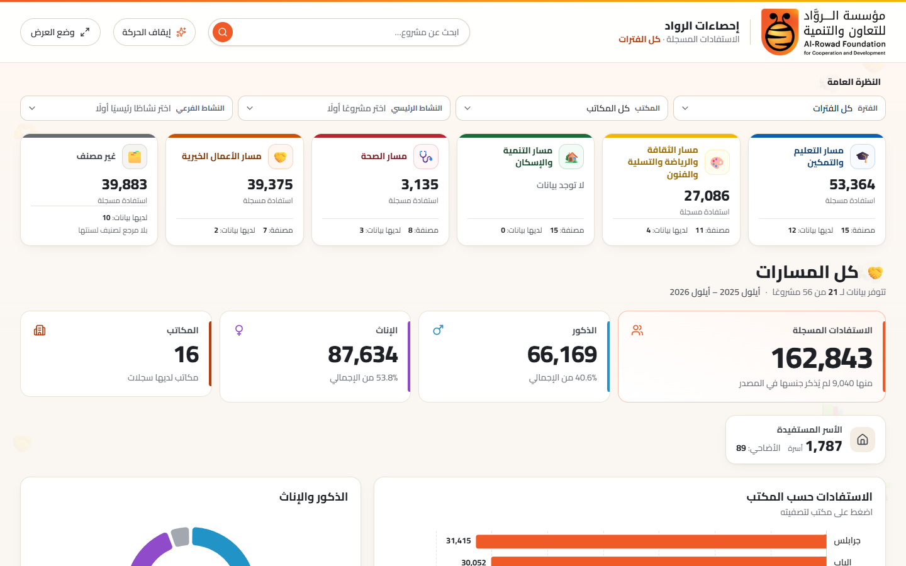 | 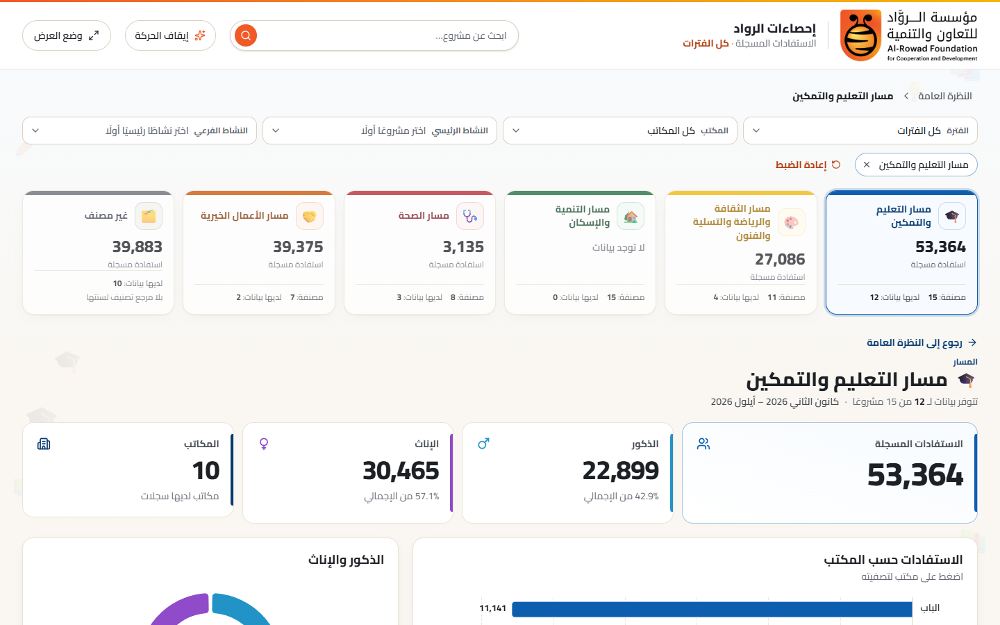 |
| 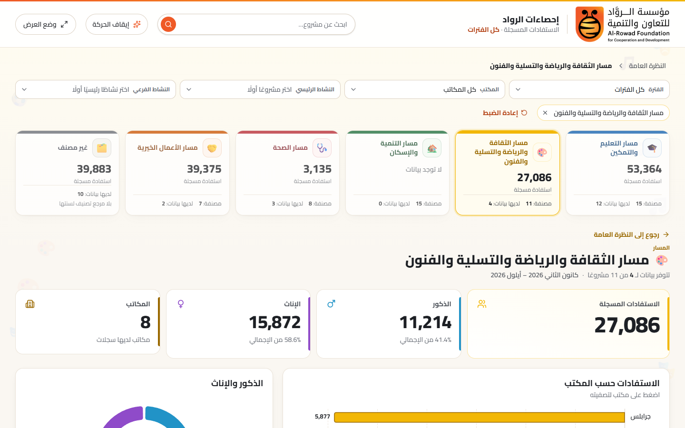 | 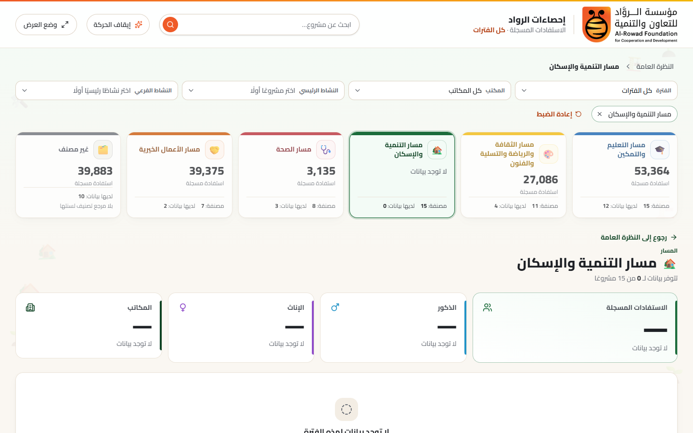 |
| 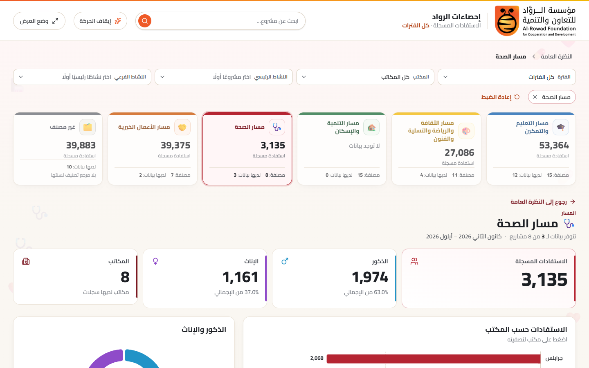 | 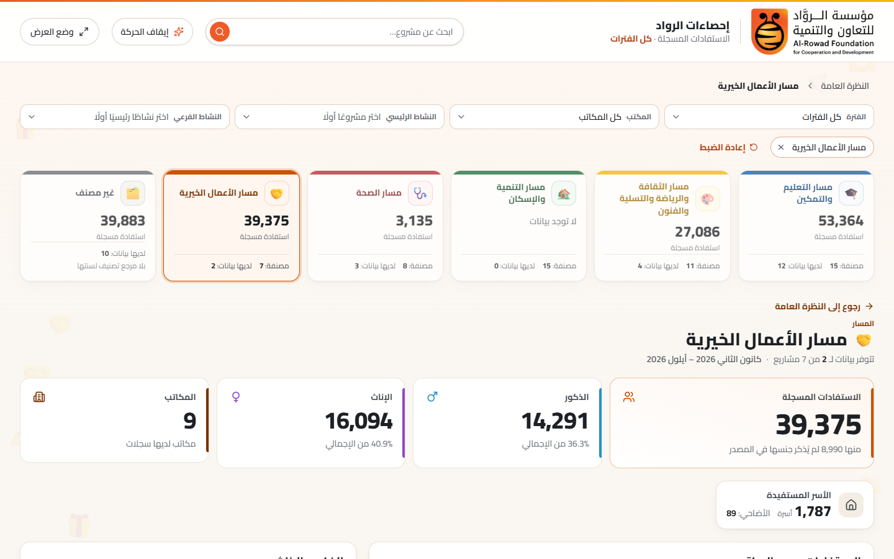 |
| 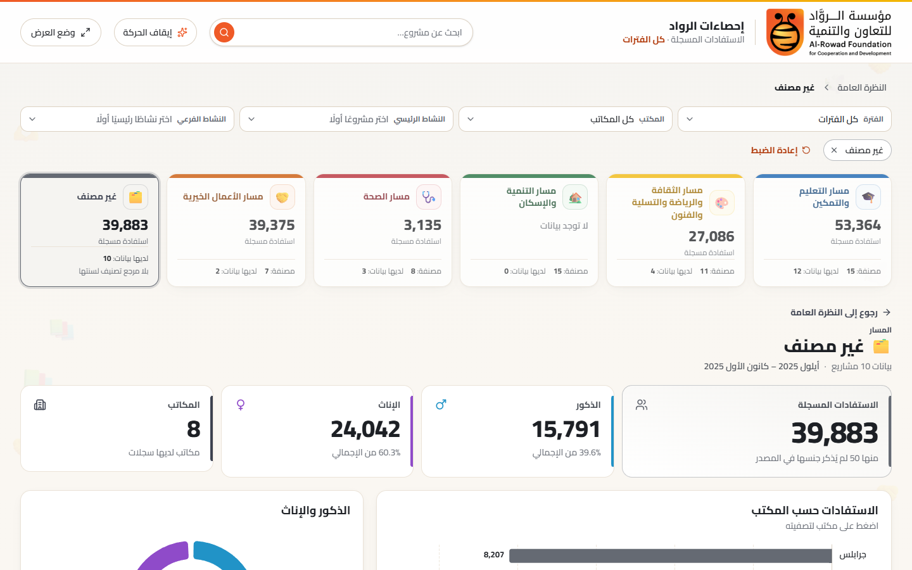 | 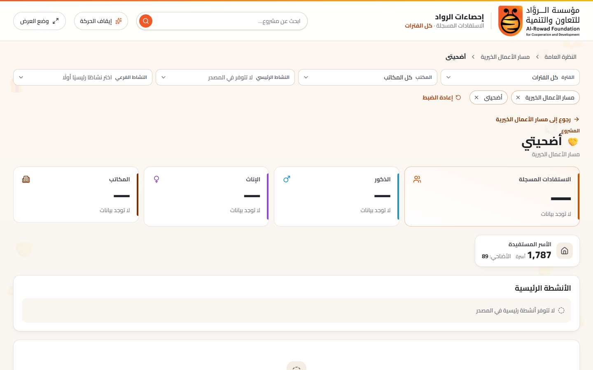 |
| 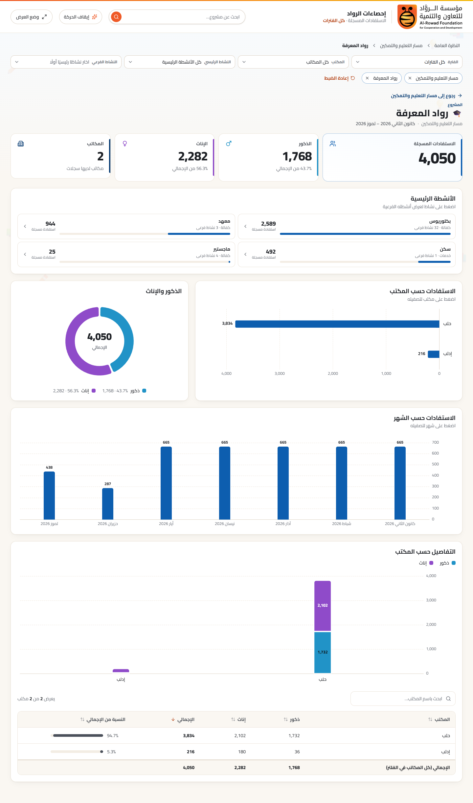 | 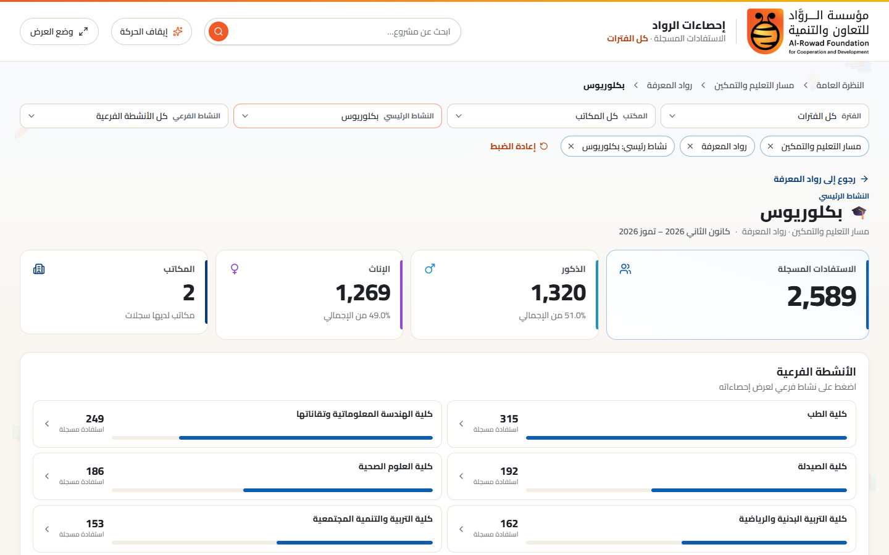 |
| 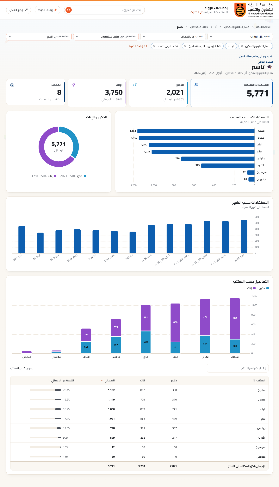 | 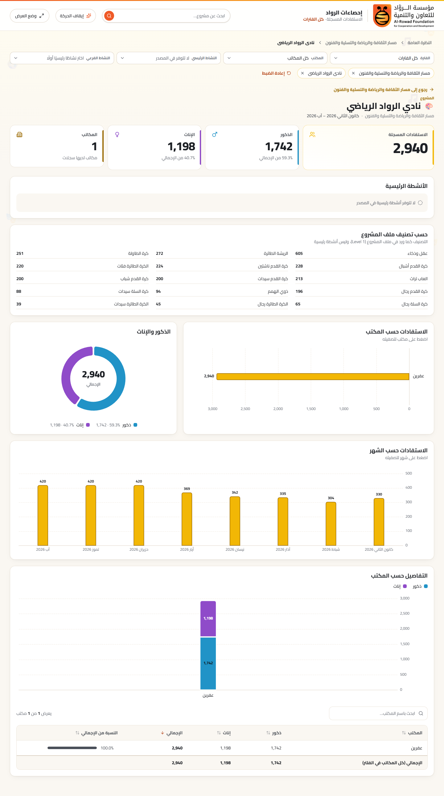 |
| 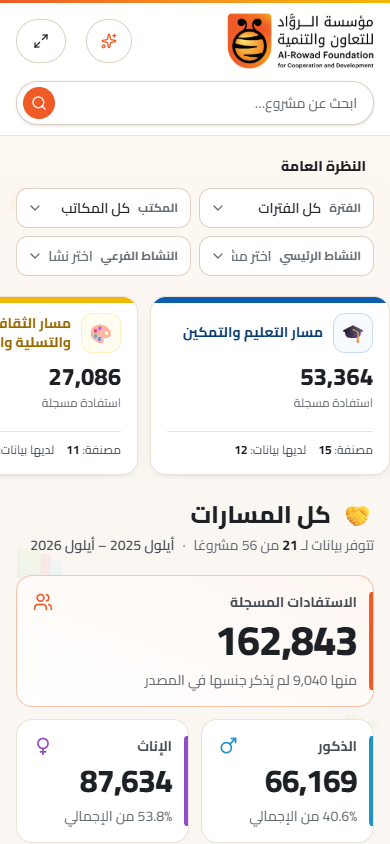 | 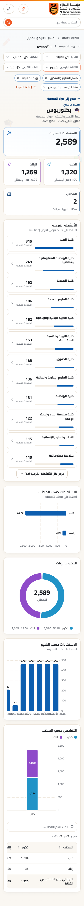 |
| 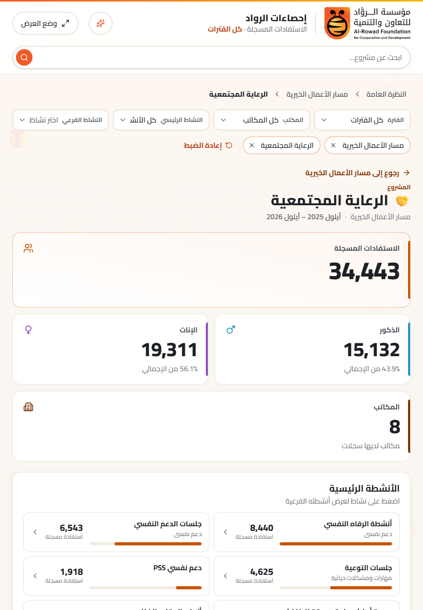 | |

## 8. ما بقي

- ملفات أرقام لـ 34 مشروعًا مصنفًا غير موجودة في `data/raw`؛ وملف «جامعة الرواد» يحتاج شهرًا أو تاريخًا موثقًا.
- مرجع تصنيف 2025 إن وُجد، لنقل سجلات 2025 من «غير مصنف» إلى مساراتها.
- قرار المؤسسة في الصفوف المعزولة الثمانية (تعارض الجنس والإجمالي) وورقة كانون الثاني في ملف 2025.
- المصادقة ولوحة الإدارة، واختبارات واجهة آلية داخل المستودع.
